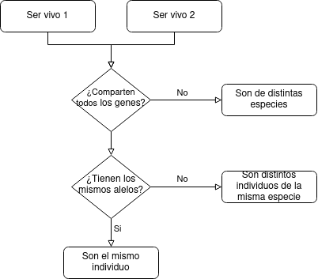

# TP1 » Introductorio

## RETO I

**_¿Podrías buscar un ejemplo de macromoléculas que almacenen información_**
**_sobre la "identidad" de un organismo dado?_**

Si, las macromoléculas que pueden almacenar información sobre la "identidad"
son los Ácidos nucleicos (AND y ARN).

> Según [Wikipedia » Ácido nucleico](https://es.wikipedia.org/wiki/%C3%81cido_nucleico#Caracter%C3%ADsticas_del_ADN):
>
> Todos los organismos poseen estas biomoléculas que dirigen y controlan la síntesis
> de sus proteínas, proporcionando la información que determina su especificidad y
> características biológicas, ya que contienen las instrucciones necesarias para
> realizar los procesos vitales y son los responsables de todas las funciones
> básicas en el organismo.

## RETO II

**_Proponé una forma de expresar la información contenida en la estructura primaria_**
**_de las proteínas usando tipos de datos de los lenguajes de programación que conocés._**

Dado que la estructura primaria de las proteínas es una cadena de aminoácidos,
podemos representarlas mediante una lista (o _array_) de aminoácidos.

Además, dado que existen 22 tipos de aminoácidos, se pueden representar (en una de sus formas)
mediante una letra que los distingue unívocamente.

Entonces alcanza con generar una lista de _chars_. Y una lista de _chars_
es simplemente un _string_. Con lo cual podemos representar la estructura primaria
de las proteínas como un _string_ de aminoácidos.

## RETO III

**_¿En qué tipo de datos podrías expresar la información de la estructura terciaria proteica?_**

Si no entiendo mal, la estructura terciaria se forma cuando "se conectan"
estructuras secundarias, particularmente _hélices alfa_ con _hojas plegadas_.

Dado este caso, se me ocurre que se podría generar un grafo donde cada nodo
es una estructura secundaria y los vértices del grafo representan las atracciones.

## RETO IV

**_Rosalind Franklin es una científica muy relevante, que tuvo menos reconocimiento del merecido.__**
**_¿Cuáles fueron sus contribuciones en este campo?_**
**_¿Qué nos cuenta su historia acerca del mundo de la ciencia?_**

> Mirá el artículo "[El Caso de Rosalind Franklin](https://mujeresconciencia.com/2014/05/09/el-caso-de-rosalind-franklin/)" de Mujeres con Ciencia.

Inicialmente, como tesis doctoral, desarrolló estudios sobre la utilización del carbón,
lo que permitió optimizar recursos y de esta forma ayudar a los aliados a ganar la Segunda
Guerra Mundial.

Pero su contribución más importante lo consiguió mejorando el aparato para la toma de
imágenes de ADN. En ese momento sus imágenes eras de la mejor calidad hasta el momento.
Esto permitió, además, que sus colegas Watson y Crick hayan escrito artículos
sobre las formas del ADN a partir de sus imágenes pero sin su consentimiento, y más
tarde a partir de ello ganar un premio Nobel, en el que tampoco reconocieron a Rosalin.

## RETO V

**_Proponé en pseudo-código un programa que prediga la estructura secundaria que adoptará_**
**_cada residuo de la secuencia proteica dada, especificándola como `H` (si es una hélice),_**
**_`B` (si es una hoja beta plegada) y `L` (si es un bucle o loop)._**

Primero defino un diccionario que mantiene, para cada aminoácido, una lista
de tuplas donde cada tupla contiene el nombre de la estructura secundaria
y el valor de preferencia para esa estructura.

Luego, dado un aminoácido busco su lista de preferencias, me quedo con la
tupla que tenga un valor mayor, y retorno el nombre contenido en dicha tupla.

```py
# Diccionario de preferencia de estructura secundaria para cada aminoácido.
preferences(aminoacid):
  dict = {
    GLU: [<H, 1.59>, <B, 0.52>, <L, 1.01>],
    ...,
    ASP: [<H, 0.99>, <B, 0.39>, <L, 1.24>],
  }
  return dict[aminoacid]

# Dada una lista de tuplas `<aminoácido, valor>`, retorna aquella con mayor `valor`.
maxTuple(list):
  if (empty(list)) throw Error("empty list")
  max = list[0]
  for item in list:
    if item.second() > max.second():
      max = item
  return max

# Función de predicción de estructura secundaria para un aminoácido.
predictSecondaryPreference(aminoacid):
  info = preferences(aminoacid)
  max = maxTuple(info)
  return max.first()
```

## PARA PENSAR

**_¿Cuántas proteínas puede sintetizar un organismo?_**

Puede sintetizar la cantidad de proteínas según la información almacenada en el AND.

**_¿De qué depende la cantidad y la característica de las proteínas_**
**_que puede sintetizar un organismo?_**

Depende de la información contenida en el ADN.

## RETO VI

**_¿Qué hace distintos a dos individuos de una especie?_**
**_Propone una forma de corroborar tu respuesta realizando un diagrama_**
**_de un posible método computacional para dicho fin._**

Cada individuo de una especie se forma con los mismos genes que sus progenitores.
Pero cada gen, a su vez, puede venir en distintos "sabores", llamados alelos.
Los alelos son pequeñas variaciones de un gen. Por ejemplo, el gen que define el
color de ojos puede venir con alelos que definen los colores (no es estrictamente así,
permítase la licencia poética). Al crearse un individuo recibe alelos de padre y madre,
algunos alelos son dominantes sobre otros, y de ese "emparejamiento" de alelos se define
la característica del nuevo individuo.

Volviendo a la pregunta original, dos seres son de la misma especie
si comparten todos los genes; y dos individuos de una misma especie
se pueden identificar (o diferenciar) por su variación de alelos.


