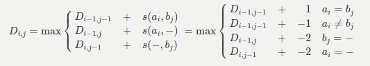
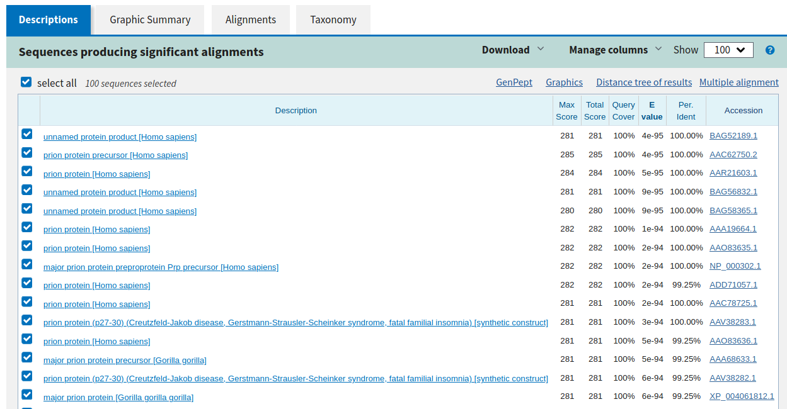
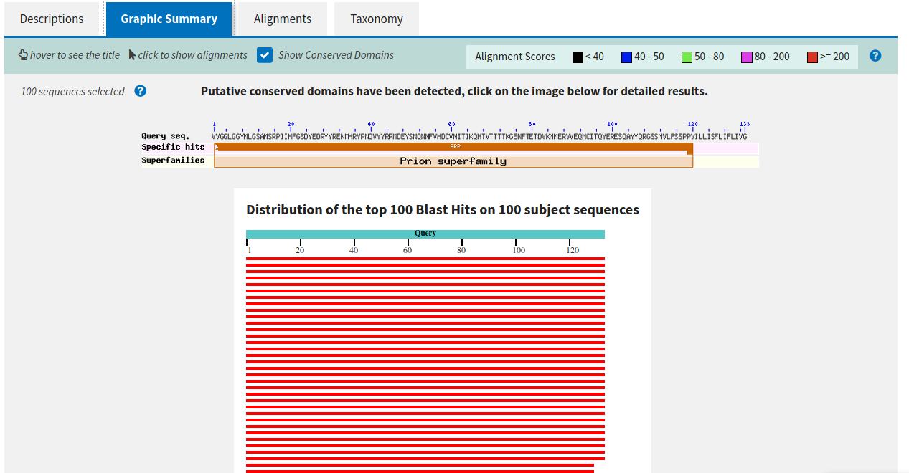
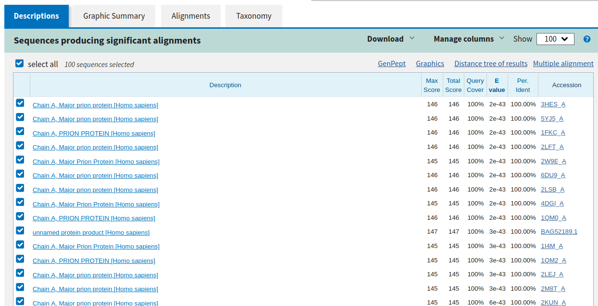
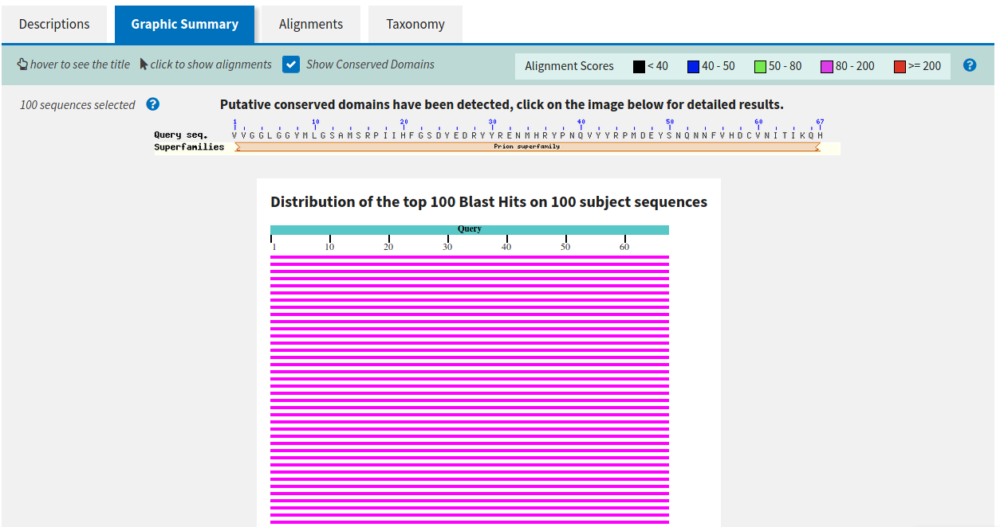
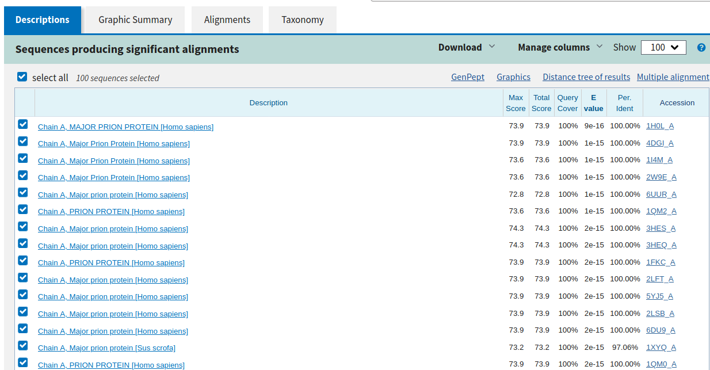
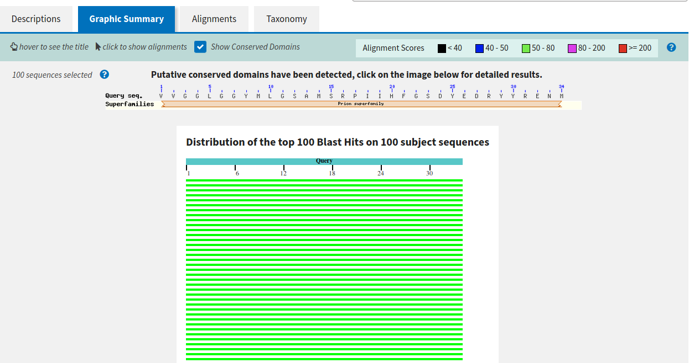

# TP5 » Alineamiento y BLAST

## PARA PENSAR

**_¿Qué tipo de información se puede extraer de la comparación de secuencias?_**
**_¿Cómo esperás que se vea en una comparación?_**

Se puede, en principio, conocer las similitudes y diferencias de nucleótidos
o aminoácidos de las secuencias. Se espera que contengan segmentos en común
pero con otros que difieran.

## PARA PENSAR

**_¿Por qué crees que es mejor evaluar las relaciones evolutivas lejanas comparando proteínas?_**

Porque en las secuencias de ácidos nucléicos puede pasar que un cambio
en un nucléotido de todas formas siga formando la misma proteína dado que existen
varios codones que forman los mismos aminoácidos.

## RETO I

**_Intentemos, entonces alinear estas dos palabras, para comprender mejor el problema._**
**_Alineá en la tabla interactiva las palabras "BANANA" y "MANZANA"._**
**_¡Tomá nota de tus observaciones y de las conclusiones que se desprendan de estas observaciones!_**

Si alineamos ambas palabras a izquierda se generan pocas similitudes.
Alinear a derecha ambas genera un poco más. En cambio meter un gap en el medio
(`BAN-ANA`) genera mayores coincidencias.

### PREGUNTAS DISPARADORAS

**_¿Existe una única forma de alinearlas?_**

No, existen múltiples formas de alinearlas

**_¿Es alguno de los posibles alineamientos mejor que otro?_**

Si,

```txt
-BANANA
MANZANA
xxxxooo
```

Obtiene tres coincidencias, pero

```txt
BANANA-
MANZANA
xooxxxx
```

Obtiene dos coincidencias. Pero luego,

```txt
BAN-ANA
MANZANA
xooxooo
```

Genera 5 coincidencias.

**_Si así fuera ¿Porqué?_**

Porque según como se ubiquen podemos obtener segmento que coinciden en más letras.

## RETO II

**_En la siguiente tabla probá distintos alineamientos para las palabras "ANA" y "ANANA"._**
**_Verás que en el margen superior izquierdo aparece un valor de identidad calculado_**
**_para cada alineamiento que intentes._**
**_¡Tomá nota de los valores de identidad observados y de las conclusiones que se_**
**_desprendan de estas observaciones!_**

Alinear ambas a izquierda genera una identidad de `0.6`, lo mismo
que alinear ambas a derecha. Centrarlas genera identidad de `0.0`.
No es posible llegar a una identidad de `1.0` dado que difieren en
la longitud de la cadena.

### PREGUNTAS DISPARADORAS

**_¿Son todos los valores iguales?_**

No, distintos alineamientos generan distintos valores de identidad.

**_¿Qué consideraciones deberían tenerse en cuenta a la hora de realizar el cálculo?_**

Sería interesante, además de alinear para generar mayor identidad,
respetar el significado de "las palabras". No es lo mismo "ANA" que "A-N-A"
porque esos _gaps_ indicarían que estaría faltando información que podría
modificar el sentido de la cadena.

**_¿Se te ocurre, distintas formas de calcularlo?_**

Se podría penalizar el hecho de meter _gaps_ "en el medio".

**_¿Serán todas ellas igualmente válidas en Biología?_**

Probablemente no, habría que analizar qué alineamientos y por ende identidades
tendrían más sentido según, por ejemplo, observaciones pre-existentes.

## RETO III

**_En la siguiente tabla probá distintos alineamientos para las palabras "ANA" y "ANANA"._**
**_Verás que en el margen superior izquierdo aparece un valor de identidad calculado para cada_**
**_alineamiento que intentes y un botón para cambiar la penalidad que se le otorga a dicho_**
**_para el cálculo de identidad._**
**_¡Probá varias combinaciones, tomá nota de los valores de identidad observados y_**
**_de las conclusiones que se desprendan de estas observaciones!_**

### PREGUNTAS DISPARADORAS

**_¿Cómo se relacionan los valores de identidad obtenidos con las penalizaciones que se imponen al gap?_**

La penalidad multiplica las disidencias disminuyendo el valor de la identidad geométricamente.
Una identidad de `0.6` y penalidad `1` se convierte en una identidad de `0.4`.
Si la penalidad sube a `2` la identidad baja a `0.2`.

**_¿Qué implicancias crees que tiene una mayor penalización de gaps?_**

A mayor penalidad de disidencias es menor el valor de identidad obtenido, osea
que generar penas más altas conlleva a definir que los _gaps_ son cada vez "más malos".

**_¿Se te ocurre alguna otra forma de penalización que no haya sido tenido en cuenta en este ejemplo?_**

Se me ocurre que podría penalizarse más dos _gaps_ contingüos a dos _gaps_ que estén
separados por una coincidencia.

### PARA PENSAR

**_Entonces, pensando en un alineamiento de ácidos nucleicos_**
**_¿Cuáles te parece que son las implicancias de abrir un gap en el alineamiento?_**

Entiendo que el hecho de tener que "partir" mediante un _gap_ implicaría
o bien que en la secuencia no se pudo observar un aminoácido o bien
que son secuencias muy distintas pero con el _gap_ se "está forzando" a que coincidan.

**_¿Qué implicaría la inserción o deleción de una región de más de un residuo?_**

Puede que esté indicando que esa inserción o deleción se debió a una mutación en la secuencia.

## RETO IV

**_En la siguiente tabla probá distintos alineamientos para las secuencias nucleotídicas._**
**_Podrás ver las traducciones para cada secuencia._**
**_¡Probá varias combinaciones, tomá nota de las observaciones y de las conclusiones que se desprendan de estas!_**

### PARA PENSAR

**_¿Dá lo mismo si el gap que introducís cae en la primera, segunda o tercer posición del codón?_**

No, no es lo mismo en donde se introduce el _gap_ porque, amén de la identidad, cambiar la posición
del _gap_ genera que se pueda o no determinar el aminoácido que se genera a partir del cada codón formado
según el alineamiento.

Por ejemplo, en `TGCGAGG`, alinearlo como `TGC-GAGG-` permite determinar solo el primer aminoácido (`C--`).
Pero alinearlo `TGCGAGG--` permite determinar el primer y segundo aminoácido (`CE-`).

**_¿Cómo ponderarías las observaciones de este ejercicio para evaluar el parecido entre dos secuencias?_**

Determinaría el valor de identidad no solo por las coincidencias de la secuencia sino también por la
cantidad  de aminoácidos que se puedan identificar pero también por la coincidencia de esos aminoácidos.

## RETO V

**_Estuvimos viendo que el alineamiento de secuencias no es trivial y requiere contemplar_**
**_los múltiples caminos posibles, teniendo en cuenta al mismo tiempo la información biológica_**
**_que restringe ese universo de posibilidades._**
**_¡Es momento de llevar entonces estos conceptos a lo concreto!_**

**_Te proponemos pensar los pasos a seguir en un alineamiento de dos secuencias cortas,_**
**_teniendo en cuenta una matriz genérica de scoring (puntuación) que contemple las_**
**_complejidades que estuvimos viendo, es decir que penalice de distinto modo una inserción_**
**_o deleción, una discordancia (mismatch) o una coincidencia (match)._**
**_Escribilos o esquematizalos en un diagrama de flujo._**

```txt
|   |  A |  B |  C  | - |
| A | +1 | -1 | -2  | 0 |
| B | -1 | +1 | -1  | 0 |
| C | -2 | -1 | +1  | 0 |
```

Alinear `ABC` con `AB`.

Caso 1:

```txt
 A B C
 A B -
+1+1+0
```

```txt
 A B C
 A - B
+1+0-1
```

```txt
 A B C
 - A B
+0-1-1
```

### PARA PENSAR

**_¿En qué consiste la programación dinámica? ¿Porqué crees que es útil en este caso?_**

a programación dinámica te permite fundamentalmente recordar cálculos costoso de manera
de no tener que volver a usar tiempo de cómputo cada vez, sino que al encontrar una comparación
que ya fue comparada previamente, se puede volver a utilizar ese valor en vez de tener que volver
a generar todo el procesamiento de cómputo para el cálculo.

Creo que puede ser sobre todo en comparaciones de cadenas locales, ya que al encontrar
otro segmento similar a uno ya calculado, no hace falta volver a generar el scoring sino
que se podría utilizar el scoring previo calculado para otra cadena.

## RETO VI

**_Utilizando la herramienta interactiva desarrollada por el Grupo de Bioinformática de Freiburg_**
**_probá distintos Gap penalties para el ejemplo propuesto y observá lo que ocurre._**
**_Interpretando la recursión, explicá con tus palabras de dónde salen los valores de la matriz_**
**_que se construye. ¡Esquematiza tus conclusiones!_**

Los valores de la matriz salen de calcular:

La celda `D{0}{0}` arranca en `0` por ser ambos _gaps_.
Luego, toda la fila `D{0}` tiene un score `-2` porque un _gap_ es distinto a cualquier valor, pero
además se le va restando el máximo de las celdas adyacentes, que en este caso es simplemente la
de la izquierda.

El resto de las celdas se completan según la regla



Darle una "penalidad positiva" al _gap_ genera que siempre convenga _matchear_ con el gap,
generando un recorrido matricial de forma de L invertida.

Por el contrario, darle "penalidad positiva" al mismatch genera que se vayan generando
distintos alineamientos. Pero esto está muy relacionado a cómo son las cadenas que se está comparando.

### PARA PENSAR

**_¿En qué casos serán de utilidad uno u otro tipo de alineamientos?_**
**_¿Qué limitaciones tendrá cada uno?_**

- El alineamiento global es útil cuando se
comparan secuencias muy similares en tamaño y composición, por
ejemplo de dos genes muy conservados.

- El alineamiento local cuando interesa alinear regiones similares entre
secuencias. Es útil cuando las secuencias a comparar son
diferentes en tamaño o poseen regiones no conservadas

### PARA PENSAR

**_Ingresá al servidor del NCBI y mirá los distintos programas_**
**_derivados del BLAST que se ofrecen_**
**_¿Para qué sirve cada uno? ¿En qué casos usarías cada uno?_**

Existen 4 programas de BLAST que ofrecen diferentes alineamientos

- Nucléotido con Nucleótido
- Nucleótido Traducido a Proteína
- Proteína a Nucléotido traducido
- Proteíana a Proteína

## RETO VII

**_Calculá el E-value y porcentaje de identidad utilizando el_**
**_programa BLAST de la siguiente secuencia input usando 20000 hits,_**
**_un e-value de 100 y tomando aquellos hits con un mínimo de 70% cobertura._**
**_Observe y discuta el comportamiento de:_**
**_E-value vs. % id, Score vs % id, Score vs E-value_**

> VVGGLGGYMLGSAMSRPIIHFGSDYEDRYYRENMHRYPNQVYYRPMDEYSNQNNFVHDCVNITIKQHTVTTTTKGENFTETDVKMMERVVEQMCITQYERESQAYYQRGSSMVLFSSPPVILLISFLIFLIVG

Mejor _e-value_: unnamed protein product [Homo sapiens] `4e-95`





El _E-Value_ es el valor que determina el margen de error en cuanto a coincidencias
de alineamiento. En comparación, el `%id` determina el porcentaje de identidad
con el alineamiento comparado con las de la base
El Score es un porcentaje que se obtiene analizando el resto de los resultados
y tratando de obtener un valor que de una revisión general de cuán buena es la coincidencia.
A diferencia del `%id` contempla todos los resultados.
En el Score vs _E-Value_ se muestra una "especie de promedio" contra el margen de error
en el alineamiento.

## RETO VIII

**_Realizá nuevas búsquedas usando la mitad de la_**
**_secuencia problema y para un cuarto de la secuencia original. Compará_**
**_los gráficos obtenidos. ¿Qué conclusiones puede sacas?_**

Para la mitad de la secuencia, o sea:

> VVGGLGGYMLGSAMSRPIIHFGSDYEDRYYRENMHRYPNQVYYRPMDEYSNQNNFVHDCVNITIKQH

Mejor _e-value_:  Chain A, Major prion protein [Homo sapiens] `2e-43`





Para un cuarto de la secuencia, o sea:

> VVGGLGGYMLGSAMSRPIIHFGSDYEDRYYRENM

Mejor _e-value_: Chain A, MAJOR PRION PROTEIN [Homo sapiens] `9e-16`





Como conclusión podría decirse que al tener una secuencia con menor
cantidad de aminoácidos existen más posibilidades de encontrar alineamientos,
pero eso no garantiza que esos alineamientos sean totales sino que hay un mejor
alineamiendo en forma parcial.

Por ejemplo, la secuencia de un cuarto puede alinear mejor con otra sobre
"el principio" de otra, sobre "el final" o sobre alguna "parte intermedia".

## RETO X

**_Realizá una nueva corrida del BLASTp, utilizando la misma_**
**_secuencia , pero ahora contra la base de datos PDB. ¿Se obtienen los_**
**_mismo resultados? ¿Qué tipo de resultados(hits) se recuperan?_**
**_¿Cuándo nos podría ser útil este modo de corrida?_**

Los resultados (si no hice mal las mediciones previas) parecieran ser similares.
Sí la diferencia es que con _pdb_ se encuentran algunos mejor resultados que con
_non-redundant_.
